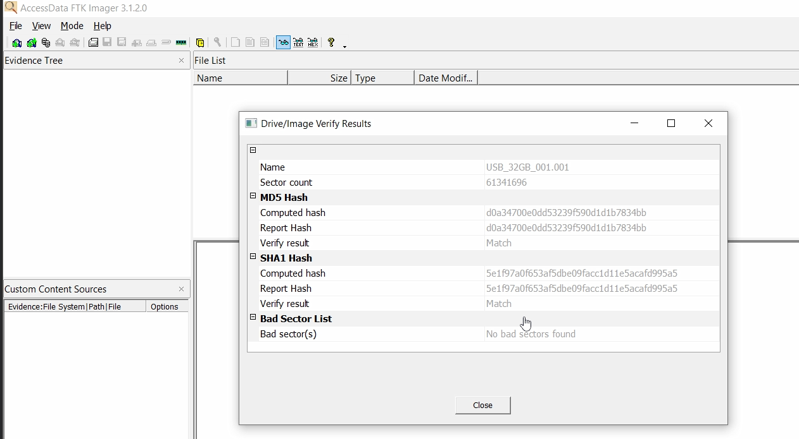
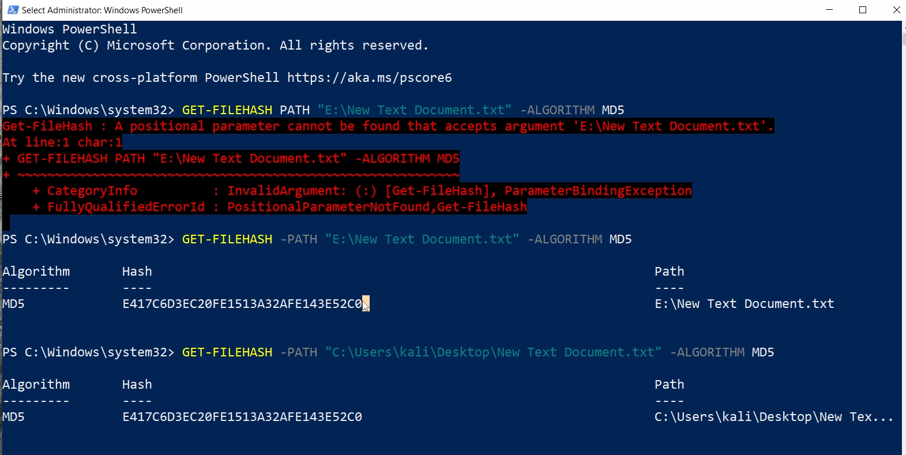
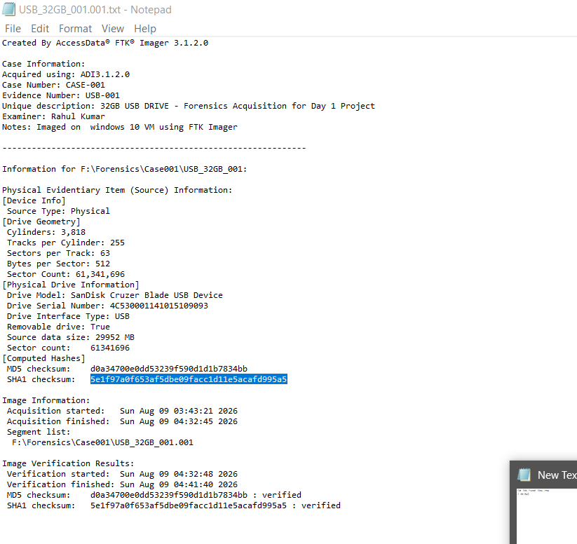
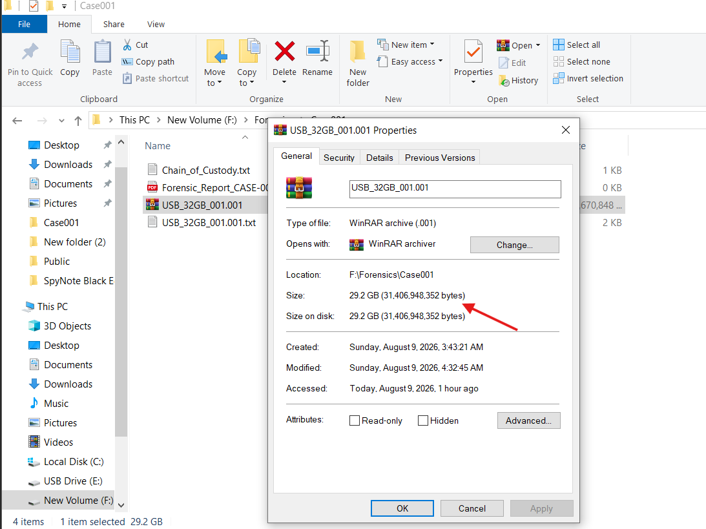
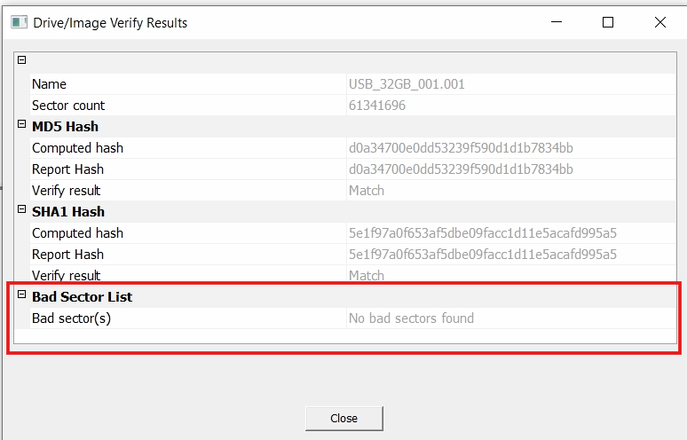

# Day 1: Forensic Imaging — 32GB USB Drive Acquisition

> **Project:** Forensic acquisition of a 32GB USB drive using FTK Imager.  
> **Date:** 09-08-2026  
> **Examiner:** [Your Full Name]  

---

## 📌 Project Overview

This project demonstrates the complete forensic workflow for acquiring a **bit-for-bit** image of a physical USB drive. The process includes:

- Forensic imaging using **FTK Imager 3.1** (Physical Drive, Raw dd format)
- Cryptographic hash verification (**MD5 & SHA-1**)
- **Cross-hash validation** (file extracted from image vs. original)
- **Chain of Custody** documentation
- **Court-admissible** forensic report

---

## 🛠️ Tools Used

| Tool | Version | Purpose |
|------|---------|---------|
| FTK Imager | 3.1.2.0 | Forensic imaging & verification |
| Windows PowerShell | 10.0 | Hash calculation & cross-validation |
| VMware Workstation | 16 | Isolated examination environment |

---

## 📊 Integrity Verification Results

| Parameter | Value |
|-----------|-------|
| **Image File** | `USB_32GB_001.001` |
| **Image Size** | 29.2 GB (61,341,696 sectors) |
| **MD5 Hash** | `d0a34700e0dd53239f590d1d1b7834bb` |
| **SHA-1 Hash** | `5e1f97a0f653af5dbe09facc1d11e5acafd995a5` |
| **Bad Sectors** | None |
| **Verification Status** | ✅ MATCH |

---

## ✅ Validation Test (Cross-Hash)

A file (`New Text Document.txt`) was extracted from the forensic image and compared with the same file on the original USB drive.

| Source | MD5 Hash |
|--------|----------|
| Original USB (E:) | `E417C6D3EC20FE1513A32AFE143E52C0` |
| Extracted from Image | `E417C6D3EC20FE1513A32AFE143E52C0` |

**Result:** ✅ MATCH — Logical integrity confirmed.

---

## 📁 Repository Structure

```

forensics-day1-imaging/
├── README.md
├── reports/
│   └── Forensic_Report_CASE-001.pdf
├── docs/
│   └── Chain_of_Custody_CASE-001.txt
├── logs/
│   └── USB_32GB_001.001.txt
└── screenshots/
├── 01_FTK_Verification.png
├── 02_Cross_Hash_Match.png
├── 03_FTK_Log_File.png
├── 04_Image_Size.png
└── 05_No_Bad_Sectors.png

```

---

## 📸 Visual Evidence

| Screenshot | Description |
|------------|-------------|
|  | FTK Imager verification — MD5 & SHA-1 Match |
|  | PowerShell cross-hash validation |
|  | Official FTK Imager acquisition log |
|  | Image file size in File Explorer |
|  | Bad sector check — None found |

---

## 📝 Key Learnings

- **Physical vs. Logical Imaging:** Physical drive captures unallocated space and hidden partitions — essential for court-admissible evidence.
- **Hash Verification:** MD5 and SHA-1 cryptographic hashes ensure image integrity.
- **Chain of Custody:** Legal documentation proving evidence was handled correctly.
- **Cross-Hash Validation:** Extracting and hashing a file from the image adds an extra layer of validation.

---

## 🎯 Next Steps

- **Day 2:** File Carving & Deleted File Recovery (using Autopsy)
- **Day 3:** Memory Forensics with Volatility

---

## 📬 Connect with Me

- **LinkedIn:** https://www.linkedin.com/in/rahuldavis91
- **Email:** rk6989834@gmail.com

---
## 📁 Related Projects
- [**Day 2: File Carving & Deleted Data Recovery**] (https://github.com/rahuldavis91/forensics-day2-filecarving)

> *"This is not just a project — this is the foundation of a forensic career."*

